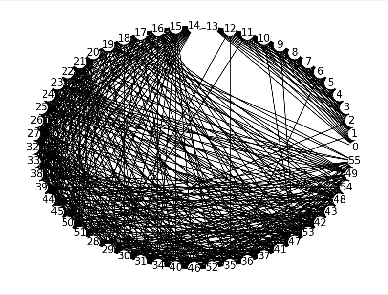

---
output:
  html_document: default
  pdf_document: default
---

# Trabalho 3 - Coloração de grafo

## ⌨️ Autores

. Iasmim de Queiroz Freitas - 190108665

. Emerson Luiz Cruz Junior - 231003531

# Setup

É necessário ter o compilador python instalado e o gerenciador de pacots `pip` para instalar as bibliotecas que nos auxiliaram na implementação desse trabalho.

```shell
pip install matplotlib networkx
```

# Run

Execute um dos comandos abaixo para executar o programa:


```shell
py main.py
```

ou


```shell
python main.py
```

# O problema:

O projeto consistia em encontrar uma disposição de partidas para um campeonato com sete times definido pelo seguinte formato:

- $14$ partidas devem acontecer
- Todos os times jogam duas vezes entre si, uma vez como mandante e a outra como visitante

Por conta, de problemas comerciais ou de segurança algumas partidas devem acontecer obrigatoriamente em rodadas diferentes.

A tabela a seguir apresenta os times participantes do campeonato, bem como as restrições para a disposição dos jogos:

{width="75%"}

# A solução:

Para solucionar o problema proposto um grafo em que cada vértice é um jogo ou rodada foi modelado. Cada aresta indica que os vértices conectados não podem ocorrer ao mesmo tempo. Como resultado disso todos os vértices que representam rodadas apresentam arestas entre si, formando um clique, bem como arestas entre partidas que tem times em comum e arestas entre as restrições presentes na tabela.

De posse do grafo modelado, um algoritmo guloso para encontrar a coloração pode ser descrito da seguinte forma em pseudocódigo, sendo $L$ uma lista com a ordem dos vértices a serem testados:

- def encontra_coloracao($idx$):
  - Se $idx$ for o primeiro índice fora da lista, retorne $True$, a coloração foi encontrada 
  - Para cada vizinho de de $L_{idx}$, se ele tem uma cor marcada marque essa cor como indisponível
  - Se nenhuma cor está disponível, retorne $False$
  - Para cada cor do menor $id$ para o maior $id$:
    - Se essa cor tiver disponível marque essa cor no vértice $L_{idx}$
      - Chame a função encontra_coloracao com $idx+1$
      -  Se ela retornou $True$, retorne $True$, a coloração já foi encontrada
      -  Desmarque essa cor no vértice $L_idx$

Com o algoritmo definido, é necessário obter uma ordem ótima de vértices para a execução da função. Sendo assim a ordem ótima encontrada é começar a testar pelo maior clique e ordenar os demais vertíces do maior grau para o menor.

O maior clique presente no grafo tem que ter tamanho $14$, pois se existir um clique maior uma coloração usando $14$ cores não será possível, uma vez que cada vértice do clique deve ter cores diferentes entre si, portanto é possível começar pelo clique formado pelos vértices das rodadas que devem estar conectadas entre si seguindo o critério estabelecido na modelagem.

# Resultados

Para realizar o desenho dos gráficos para a visualização dos grafos, duas bibliotecas do python foram usadas a networkx e a matplotlib, as cores de cada vértice são definidas seguindo uma tabela e o número da rodada associada a esse vértice, com exceção dos vértices de $0$ a $13$, que são os vértices associados as rodadas, eles irão apresentar cor dourada no gráfico.

## Grafo antes de colorir

{width="75%"}

Os vértices com cor dourada são os vértices que representam as rodadas.

## Grafo após colorir

{width="75%"}

```shell
Legenda --------------
Rodada 1: ---> red
Rodada 2: ---> blue
Rodada 3: ---> green
Rodada 4: ---> yellow
Rodada 5: ---> purple
Rodada 6: ---> orange
Rodada 7: ---> pink
Rodada 8: ---> brown
Rodada 9: ---> gray
Rodada 10: ---> violet
Rodada 11: ---> lightblue
Rodada 12: ---> cyan
Rodada 13: ---> olive
Rodada 14: ---> teal
```

## Rodadas

```shell
Rodada 1 -------------->
AFC vs DFC
OFC vs LFC
CFC vs TFC
Rodada 2 -------------->
TFC vs DFC
AFC vs LFC
CFC vs OFC
Rodada 3 -------------->
TFC vs AFC
LFC vs CFC
FFC vs DFC
Rodada 4 -------------->
DFC vs FFC
TFC vs LFC
AFC vs OFC
Rodada 5 -------------->
DFC vs LFC
TFC vs FFC
AFC vs CFC
Rodada 6 -------------->
DFC vs OFC
TFC vs CFC
FFC vs LFC
Rodada 7 -------------->
AFC vs TFC
OFC vs DFC
CFC vs FFC
Rodada 8 -------------->
DFC vs CFC
FFC vs TFC
OFC vs AFC
Rodada 9 -------------->
DFC vs TFC
LFC vs AFC
FFC vs OFC
Rodada 10 -------------->
TFC vs OFC
LFC vs DFC
FFC vs CFC
Rodada 11 -------------->
LFC vs TFC
OFC vs FFC
CFC vs AFC
Rodada 12 -------------->
DFC vs AFC
LFC vs FFC
OFC vs CFC
Rodada 13 -------------->
LFC vs OFC
FFC vs AFC
CFC vs DFC
Rodada 14 -------------->
AFC vs FFC
OFC vs TFC
CFC vs LFC
```

