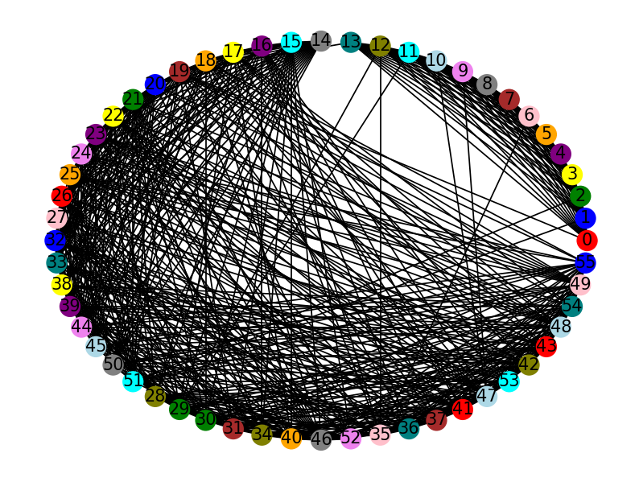

# Trabalho 3 - Coloração de grafo

<h2>⌨️ Autores</h2>
<ul>
  <li>Iasmim de Queiroz Freitas - 190108665</li>
  <li>Emerson Luiz Cruz Junior - 231003531</li>
</ul>
<table>
  <tr>
    <td align="center"><a href="https://github.com/iasmimqf" target="_blank"><br /><sub><b>Iasmim</b></sub></a><br /></td>
    <td align="center"><a href="https://github.com/EmersonJr" target="_blank"><br /><sub><b>Emerson Junior</b></sub></a><br /></td>
</table>

# Setup

É necessário ter o compilador python instalado e o gerenciador de pacots `pip` para instalar as bibliotecas que nos auxiliaram na implementação desse trabalho.

```shell
pip install matplotlib networkx
```

# Run

Execute um dos comandos abaixo para executar o programa:


```shell
py main.py
```

ou


```shell
python main.py
```

# O problema:

O projeto consistia em encontrar uma disposição de partidas para um campeonato com sete times definido pelo seguinte formato:

- 14 partidas devem acontecer
- Todos os times jogam duas vezes entre si, uma vez como mandante e a outra como visitante

Por conta, de problemas comerciais ou de segurança algumas partidas devem acontecer obrigatoriamente em rodadas diferentes.

A tabela a seguir apresenta os times participantes do campeonato, bem como as restrições para a disposição dos jogos:


# A solução:

Para solucionar o problema proposto um grafo em que cada vértice é um jogo ou rodada foi modelado. Cada aresta indica uma partida que não pode acontecer na mesma rodada que alguma outra ou uma rodada que não pode acontecer ao mesmo tempo que uma partida. Como resultado disso arestas entre todos os vértices que representam rodadas irão existir, bem como arestas entre partidas que tem times em comum e arestas entre as restrições da tabela.

De posse do grafo modelado, um algoritmo guloso para encontrar a coloração pode ser descrito da seguinte forma em pseudocódigo, sendo L uma lista com a ordem dos vértices a serem testados:

- def encontra_coloracao(idx):
  - Se esse for o primeiro índice fora da lista, retorne True, a coloração foi encontrada 
  - Para cada vizinho de de L[idx}, se ele tem uma cor marcada marque essa cor como indisponível
  - Se nenhuma cor está disponível, retorne False
  - Para cada cor do menor id para o maior id:
    - Se essa cor tiver disponível marque essa cor no vértice L[idx]
      - Chame a função encontra_coloracao com idx+1
      -  Se ela retornou True, retorne True, a coloração já foi encontrada
      -  Desmarque essa cor no vértice L[idx]

Com o algoritmo definido, é necessário definir uma ordem ótima para executar a função. Para tal a ordem ótima encontrada foi começar pelo maior clique e ordenar os demais vertíces do maior grau para o menor.

O maior clique presente no grafo tem que ter tamanho 14, pois se existir um clique maior uma coloração usando 14 cores não será possível, uma vez que cada vértice do clique deverá ter cores diferentes entre si, portanto é possível começar pelo clique das rodadas que devem estar conectadas entre si pelo critério estabelecido na modelagem.

# Resultados

Para realizar os gráficos para a visualização dos grafos duas bibliotecas do python foram usadas a networkx e a matplotlib.

## Grafo antes de colorir


Os vértices com cor dourada são os vértices que representam as rodadas.

## Grafo após colorir



```shell
Legenda --------------
Rodada 1: ---> red
Rodada 2: ---> blue
Rodada 3: ---> green
Rodada 4: ---> yellow
Rodada 5: ---> purple
Rodada 6: ---> orange
Rodada 7: ---> pink
Rodada 8: ---> brown
Rodada 9: ---> gray
Rodada 10: ---> violet
Rodada 11: ---> lightblue
Rodada 12: ---> cyan
Rodada 13: ---> olive
Rodada 14: ---> teal
```

## Rodadas

```shell
Rodada 1 -------------->
AFC vs DFC
OFC vs LFC
CFC vs TFC
Rodada 2 -------------->
TFC vs DFC
AFC vs LFC
CFC vs OFC
Rodada 3 -------------->
TFC vs AFC
LFC vs CFC
FFC vs DFC
Rodada 4 -------------->
DFC vs FFC
TFC vs LFC
AFC vs OFC
Rodada 5 -------------->
DFC vs LFC
TFC vs FFC
AFC vs CFC
Rodada 6 -------------->
DFC vs OFC
TFC vs CFC
FFC vs LFC
Rodada 7 -------------->
AFC vs TFC
OFC vs DFC
CFC vs FFC
Rodada 8 -------------->
DFC vs CFC
FFC vs TFC
OFC vs AFC
Rodada 9 -------------->
DFC vs TFC
LFC vs AFC
FFC vs OFC
Rodada 10 -------------->
TFC vs OFC
LFC vs DFC
FFC vs CFC
Rodada 11 -------------->
LFC vs TFC
OFC vs FFC
CFC vs AFC
Rodada 12 -------------->
DFC vs AFC
LFC vs FFC
OFC vs CFC
Rodada 13 -------------->
LFC vs OFC
FFC vs AFC
CFC vs DFC
Rodada 14 -------------->
AFC vs FFC
OFC vs TFC
CFC vs LFC
```
