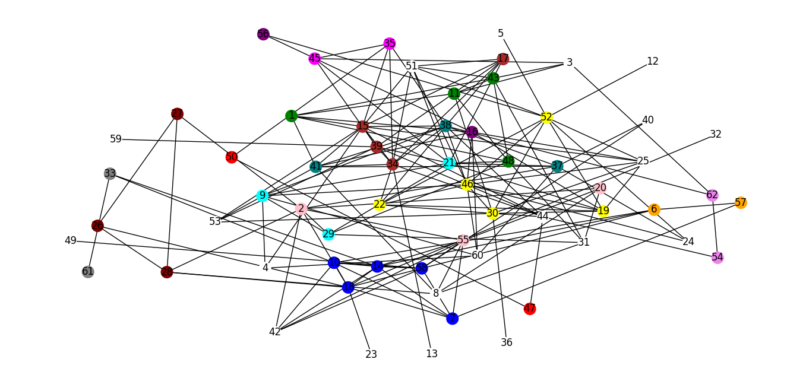

# Trabalho 1 - Clique Maximais e Coeficiente de Aglomeração

### Participantes:
- Emerson Luiz Cruz Junior - 231003531
- Lucas Gabriel de Oliveira Lima - 231003406


# Setup
Para instalar as dependencias que utilizamos no projeto, é necessário ter o compilador python instalado e o gerenciador de pacotes `pip` que utilizamos para instalar as bibliotecas que nos auxiliaram neste trabalho
```sheel
pip install matplotlib networkx
```

# Run
Executar o seguinte comando no terminal:
```sheel
py main.py
```
ou 
```sheel
python main.py
```


# Resultados
Deixaremos os resultados obtidos neste README, mas também é possível visualizá-lo rodando o projeto

## Grau dos vértices

```sheel
Grau do vértice 1: 6
Grau do vértice 2: 8
Grau do vértice 3: 4
Grau do vértice 4: 3
Grau do vértice 5: 1
Grau do vértice 6: 4
Grau do vértice 7: 6
Grau do vértice 8: 5
Grau do vértice 9: 6
Grau do vértice 10: 7
Grau do vértice 11: 5
Grau do vértice 12: 1
Grau do vértice 13: 1
Grau do vértice 14: 8
Grau do vértice 15: 12
Grau do vértice 16: 7
Grau do vértice 17: 6
Grau do vértice 18: 9
Grau do vértice 19: 7
Grau do vértice 20: 4
Grau do vértice 21: 9
Grau do vértice 22: 6
Grau do vértice 23: 1
Grau do vértice 24: 3
Grau do vértice 25: 6
Grau do vértice 26: 3
Grau do vértice 27: 3
Grau do vértice 28: 5
Grau do vértice 29: 5
Grau do vértice 30: 9
Grau do vértice 31: 5
Grau do vértice 32: 1
Grau do vértice 33: 3
Grau do vértice 34: 10
Grau do vértice 35: 5
Grau do vértice 36: 1
Grau do vértice 37: 7
Grau do vértice 38: 11
Grau do vértice 39: 8
Grau do vértice 40: 2
Grau do vértice 41: 8
Grau do vértice 42: 5
Grau do vértice 43: 6
Grau do vértice 44: 7
Grau do vértice 45: 4
Grau do vértice 46: 11
Grau do vértice 47: 2
Grau do vértice 48: 6
Grau do vértice 49: 1
Grau do vértice 50: 2
Grau do vértice 51: 7
Grau do vértice 52: 10
Grau do vértice 53: 4
Grau do vértice 54: 2
Grau do vértice 55: 7
Grau do vértice 56: 2
Grau do vértice 57: 2
Grau do vértice 58: 9
Grau do vértice 59: 1
Grau do vértice 60: 5
Grau do vértice 61: 1
Grau do vértice 62: 3
```


## Cliques maximais

```sheel
[46, 19, 52, 22, 30]
[46, 19, 52, 25, 30]
[7, 10, 14, 18, 58]
[17, 34, 51, 15]
[34, 44, 15, 39]
[17, 34, 15, 39]
[17, 34, 38, 15]
[34, 44, 38, 15]
[41, 34, 38, 15]
[34, 35, 38, 15]
[16, 25, 19, 46]
[42, 58, 14, 55]
[10, 42, 58, 14]
[58, 55, 14, 7]
[10, 58, 6, 14]
[48, 1, 43, 11]
[17, 51, 21]
[51, 52, 46]
[41, 53, 15]
[45, 21, 39]
[17, 21, 39]
[15, 53, 39]
[41, 37, 38]
[48, 43, 31]
[48, 29, 31]
[48, 21, 29]
[26, 27, 28]
[24, 52, 46]
[38, 46, 22]
[38, 34, 22]
[18, 26, 28]
[16, 60, 46]
[33, 10, 14]
[9, 21, 29]
[38, 9, 46]
[9, 60, 46]
[8, 20, 55]
[8, 20, 31]
[9, 4, 60]
[11, 43, 3]
[2, 27, 28]
[2, 20, 55]
[2, 18, 28]
[2, 42, 55]
[16, 1, 41]
[1, 41, 15]
[62, 54]
[44, 54]
[56, 52]
[49, 58]
[44, 47]
[50, 47]
[51, 43]
[40, 58]
[59, 39]
[62, 38]
[60, 37]
[21, 37]
[40, 37]
[35, 45]
[50, 35]
[33, 61]
[53, 30]
[44, 30]
[36, 30]
[25, 15]
[24, 37]
[19, 21]
[18, 23]
[32, 18]
[16, 56]
[34, 13]
[12, 52]
[11, 30]
[8, 28]
[8, 41]
[57, 7]
[57, 6]
[52, 5]
[4, 15]
[3, 62]
[3, 45]
[2, 29]
[2, 37]
```


## Coeficiente de Aglomeração de cada Vértice

```sheel
Coeficiente de Aglomeração do vértice 1: 0.3333333333333333
Coeficiente de Aglomeração do vértice 2: 0.14285714285714285
Coeficiente de Aglomeração do vértice 3: 0.16666666666666666
Coeficiente de Aglomeração do vértice 4: 0.3333333333333333
Coeficiente de Aglomeração do vértice 5: 0.0
Coeficiente de Aglomeração do vértice 6: 0.5
Coeficiente de Aglomeração do vértice 7: 0.5333333333333333
Coeficiente de Aglomeração do vértice 8: 0.2
Coeficiente de Aglomeração do vértice 9: 0.26666666666666666
Coeficiente de Aglomeração do vértice 10: 0.5238095238095238
Coeficiente de Aglomeração do vértice 11: 0.4
Coeficiente de Aglomeração do vértice 12: 0.0
Coeficiente de Aglomeração do vértice 13: 0.0
Coeficiente de Aglomeração do vértice 14: 0.5
Coeficiente de Aglomeração do vértice 15: 0.25757575757575757
Coeficiente de Aglomeração do vértice 16: 0.23809523809523808
Coeficiente de Aglomeração do vértice 17: 0.6
Coeficiente de Aglomeração do vértice 18: 0.2222222222222222
Coeficiente de Aglomeração do vértice 19: 0.5238095238095238
Coeficiente de Aglomeração do vértice 20: 0.5
Coeficiente de Aglomeração do vértice 21: 0.1388888888888889
Coeficiente de Aglomeração do vértice 22: 0.5333333333333333
Coeficiente de Aglomeração do vértice 23: 0.0
Coeficiente de Aglomeração do vértice 24: 0.3333333333333333
Coeficiente de Aglomeração do vértice 25: 0.5333333333333333
Coeficiente de Aglomeração do vértice 26: 0.6666666666666666
Coeficiente de Aglomeração do vértice 27: 0.6666666666666666
Coeficiente de Aglomeração do vértice 28: 0.4
Coeficiente de Aglomeração do vértice 29: 0.3
Coeficiente de Aglomeração do vértice 30: 0.25
Coeficiente de Aglomeração do vértice 31: 0.3
Coeficiente de Aglomeração do vértice 32: 0.0
Coeficiente de Aglomeração do vértice 33: 0.3333333333333333
Coeficiente de Aglomeração do vértice 34: 0.3333333333333333
Coeficiente de Aglomeração do vértice 35: 0.3
Coeficiente de Aglomeração do vértice 36: 0.0
Coeficiente de Aglomeração do vértice 37: 0.047619047619047616
Coeficiente de Aglomeração do vértice 38: 0.23636363636363636
Coeficiente de Aglomeração do vértice 39: 0.2857142857142857
Coeficiente de Aglomeração do vértice 40: 0.0
Coeficiente de Aglomeração do vértice 41: 0.25
Coeficiente de Aglomeração do vértice 42: 0.6
Coeficiente de Aglomeração do vértice 43: 0.3333333333333333
Coeficiente de Aglomeração do vértice 44: 0.23809523809523808
Coeficiente de Aglomeração do vértice 45: 0.16666666666666666
Coeficiente de Aglomeração do vértice 46: 0.3090909090909091
Coeficiente de Aglomeração do vértice 47: 0.0
Coeficiente de Aglomeração do vértice 48: 0.4
Coeficiente de Aglomeração do vértice 49: 0.0
Coeficiente de Aglomeração do vértice 50: 0.0
Coeficiente de Aglomeração do vértice 51: 0.23809523809523808
Coeficiente de Aglomeração do vértice 52: 0.24444444444444444
Coeficiente de Aglomeração do vértice 53: 0.3333333333333333
Coeficiente de Aglomeração do vértice 54: 0.0
Coeficiente de Aglomeração do vértice 55: 0.38095238095238093
Coeficiente de Aglomeração do vértice 56: 0.0
Coeficiente de Aglomeração do vértice 57: 0.0
Coeficiente de Aglomeração do vértice 58: 0.3611111111111111
Coeficiente de Aglomeração do vértice 59: 0.0
Coeficiente de Aglomeração do vértice 60: 0.3
Coeficiente de Aglomeração do vértice 61: 0.0
Coeficiente de Aglomeração do vértice 62: 0.0
```

## Coeficiente de Aglomeração Médio 
```sheel
Coeficiente de Aglomeração Médio: 0.2589582460550202
```


## Grafo com cliques maximais pintados por cor:
Cabe uma explicação de como escolhemos pintar os cliques nesta parte. Como muitos vértices pertencem a mais de um clique, decidimos ordenar os cliques decrescentemente pelo tamanho e pintar os cliques tal que todos os seus vétices não fossem pintados por um outro clique previamente, escolhendo cores aleatóriamente. Por fim, os vértices que acabaram não sendo pintados, por conta de não haver um clique maximal tal que ele e todos os outros vértices do clique não tivesse sido pintados anteriormente, foram pintados de branco. Com isso, obtivemos o seguinte resultado:


